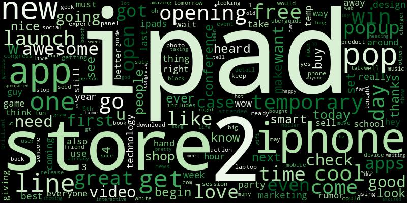
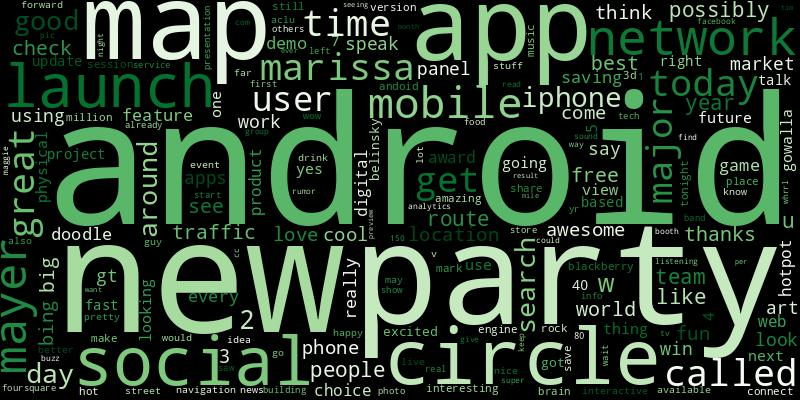

## Title PlacwHolder

aAuthor: Dylan Dey

This project it available on github here: link

The Author can be reached at the following email: ddey2985@gmail.com

associated blog for BERT transfer learning using a sklearn wrapper to easily create a powerful sentiment classifier with a small dataset can be found at link below.

[Blog Link](https://dev.to/ddey117/quick-bert-pre-trained-model-for-sentiment-analysis-with-scikit-wrapper-3jcp)

## Overview

Process twitter text data to gain insights on a brand and associated products. Create a machine learning sentiment classifier in order to predict sentiment in never before seen tweets. Create word freqency distribtuions, wordclouds, bigrams, and quadgrams to easily asses actionable insight to address concerns for the brand and it's product line. 

## Business Problem

A growing buisness with an established social media presence wants to explore options for generating actionable insights from twitter text data. They already plan to host a party to reveal their newest product. They are thinking of asking the crowd to participate in giving some feedback on how a collection of tweets about their brand makes them feel in order to win prizes and boost their social media traffic for the event.

Apple decided to host an event in 2011 in Austin during a [SXSW](https://www.sxsw.com/) event in order to crowd source some labeled twitter data involving their company and their competitor, Google.

Using this data, sourced from [CrowdFlower](), as well as some data from an additional [Apple Twitter Sentiment Dataset]() also made avaiable from CrowdFlower but cleaned and processed and made avaiable on [kaggle]() by author Chanran Kim, a machine learning classifier will be created in order to predict for sentiment contained within a tweet and show how it could be used in tandum with some NLP techniques to extract actionable insights from cluttered tweet data in a manageable way. 

# Data Exploration 
PLACEHOLDER FOR WORD CLOUDS


All functions used to preprocess twitter data, such as removing noise from text and tokenizing, as well as the functions for creating confusion plots to quickly assess performance are shown below.

```
#list of all functions for modeling
#and processing

#force lowercase of text data
def lower_case_text(text_series):
    text_series = text_series.apply(lambda x: str.lower(x))
    return text_series

#remove URL links from text
def strip_links(text):
    link_regex = re.compile('((https?):((\/\/)|(\\\\))+([\w\d:#@%\/;$()~_?\+-=\\\.&](#!)?)*)|{link}/gm')
    links = re.findall(link_regex, text)
    for link in links:
        text = text.replace(link[0], ', ')    
    return text

#remove '@' and '#' symbols from text
def strip_all_entities(text):
    entity_prefixes = ['@','#']
    for separator in  string.punctuation:
        if separator not in entity_prefixes:
            text = text.replace(separator,' ')
    words = []
    for word in text.split():
        word = word.strip()
        if word:
            if word[0] not in entity_prefixes:
                words.append(word)
    return ' '.join(words)

#tokenize text and remove stopwords
def process_text(text):
    tokenizer = TweetTokenizer()
    
    stopwords_list = stopwords.words('english') + list(string.punctuation)
    stopwords_list += ["''", '""', '...', '``']
    my_stop = ["#sxsw",
               "sxsw",
               "sxswi",
               "#sxswi's",
               "#sxswi",
               "southbysouthwest",
               "rt",
               "tweet",
               "tweet's",
               "twitter",
               "austin",
               "#austin",
               "link",
               "1/2",
               "southby",
               "south",
               "texas",
               "@mention",
               "ï",
               "ï",
               "½ï",
               "¿",
               "½",
               "link", 
               "via", 
               "mention",
               "quot",
               "amp",
               "austin"
              ]

    stopwords_list +=  my_stop 
    
    tokens = tokenizer.tokenize(text)
    stopwords_removed = [token for token in tokens if token not in stopwords_list]
    return stopwords_removed
    


#master preprocessing function
def Master_Pre_Vectorization(text_series):
    text_series = lower_case_text(text_series)
    text_series = text_series.apply(strip_links).apply(strip_all_entities)
    text_series = text_series.apply(unidecode.unidecode).apply(html.unescape)
    text_series =text_series.apply(process_text)
    lemmatizer = WordNetLemmatizer()
    text_series = text_series.apply(lambda x: [lemmatizer.lemmatize(word) for word in x])
    return text_series.str.join(' ').copy()


#function for intepreting results of models
#takes in a pipeline and training data
#and prints cross_validation scores 
#and average of scores


def cross_validation(pipeline, X_train, y_train):
    scores = cross_val_score(pipeline, X_train, y_train)
    agg_score = np.mean(scores)
    print(f'{pipeline.steps[1][1]}: Average cross validation score is {agg_score}.')


#function to fit pipeline
#and return subplots 
#that show normalized and 
#regular confusion matrices
#to easily intepret results
def plot_confusion_matrices(pipe):
    
    pipe.fit(X_train, y_train)
    y_true = y_test
    y_pred = pipe.predict(X_test)

    matrix_norm = confusion_matrix(y_true, y_pred, normalize='true') 
    matrix = confusion_matrix(y_true, y_pred) 

    fig, (ax1, ax2) = plt.subplots(ncols = 2,figsize=(10, 5))
    sns.heatmap(matrix_norm,
                annot=True, 
                fmt='.2%', 
                cmap='YlGn',
                xticklabels=['Pos_predicted', 'Neg_predicted'],
                yticklabels=['Positive Tweet', 'Negative_Tweet'],
                ax=ax1)
    sns.heatmap(matrix,
                annot=True, 
                cmap='YlGn',
                fmt='d',
                xticklabels=['Pos_predicted', 'Neg_predicted'],
                yticklabels=['Positive Tweet', 'Negative_Tweet'],
                ax=ax2)
    plt.show();

    
#loads a fitted model from memory 
#returns confusion matrix and
#returns normalized confusion matrix
#calculated using given test data
def confusion_matrix_bert_plots(model_path, X_test, y_test):
    
    model = load_model(model_path)
    
    y_pred = model.predict(X_test)

    matrix_norm = confusion_matrix(y_test, y_pred, normalize='true')

    matrix = confusion_matrix(y_test, y_pred)

    fig, (ax1, ax2) = plt.subplots(ncols = 2,figsize=(10, 5))
    sns.heatmap(matrix_norm,
                annot=True, 
                fmt='.2%', 
                cmap='YlGn',
                xticklabels=['Pos_predicted', 'Neg_predicted'],
                yticklabels=['Positive Tweet', 'Negative_Tweet'],
                ax=ax1)
    sns.heatmap(matrix,
                annot=True, 
                cmap='YlGn',
                fmt='d',
                xticklabels=['Pos_predicted', 'Neg_predicted'],
                yticklabels=['Positive Tweet', 'Negative_Tweet'],
                ax=ax2)
    plt.show();
```


### Class Imbalance of Dataset

The twitter data used for this project was collected from multiple sources from [CrowdFlower](https://appen.com/datasets-resource-center/). The project will only focus on binary sentiment (positive or negative). The total amount of tweets and associated class balances are show below. This distribution is further broken down by brand in the chart below the graphs.


#### Apple Positive vs Negative Tweet Counts
positive    0.654194
negative    0.345806
+++++++++++++++++++++++
positive    2028
negative    1072
+++++++++++++++++++++++++++++++++++++++++++++++++++
#### Google Positive vs Negative Tweet Counts
positive    740
negative    136
+++++++++++++++++++++++
positive    0.844749
negative    0.155251


#### Word Clouds





###### Please See Notebook for bigrams, trigrams, quadrgrams.

#### Some observations from exploring the data:

- Multiple complaints about issues with iphone 6 and its new touch id feature. Some googling unvealed an issue in which iphone 6 touch id button / home button would malfunction and heat up to high temperatures. 
- many complaints about phone chargers 
- high negative sentiment for iphone batteries 
- Some users displeased with issues with apple news app
- apple ipad 2 described as a design headache
- Complaints about customer service
- public image described as fascist 


Recommend to focus on improving battery life and quality. Improve phone accessories for charging and protecting battery. (apple did improvea lot on this since 2011 when many of the tweets were collected)

Address technical issues with iphone 6 and apple news app crashing.

Launch public relations campaign and give back to community to booster public image.

Reasses training protocols for customer facing employees and ensure customer service is a cornerstone of Apple culture.

#### Proof of Concept
Actionable insight can be gained with enough social media data. A reasonable amount of labeled data can be budgeted for a growing buisness in order to train a machine learning sentiment classifier on that data and deploy it in order to gain more insights into consumer sentiment on your brand or products. 

## Data Modeling

#### Classification Metric Understanding


#### Confusion Matrix Description

A true positive in the current context would be when the model correctly identifies a tweet with positive sentiment as positive. A true negative would be when the model correctly identifies a tweet with negative sentiment as containing negative sentiment. Both are important and both can be described by the overall accuracy of the model.

True negatives are really at the heart of the model, as this is the situation in which Apple would have a call to action. An appropriately identified tweet with negative sentiment can be properly examined using some simple NLP techniques to get a better understanding at what is upsetting customers involved with our brand and competitor's brands. Bigrams, quadgrams, and other word frequency analysis can help Apple to address brand concerns. 

True positives are also important. Word frequency analysis can be used to summarize what consumers think Apple is doing right and also what consumers like about Apple's competitors. 

There will always be some error involved in creating a predictive model. The model will incorrectly identify positive tweets as negative and vice versa. That means the error in any classification model in this context can be described by ratios of true positives or negatives vs false positives or negatives.

A false positive would occur when the model incorrectly identifies a tweet containing negative sentiment as a tweet that contains positive sentiment. Given the context of the business model, this would mean more truly negative sentiment will be left out of analyzing key word pairs for negative tweets. This could be interpreted as loss in analytical ability for what we care about most given the buisness problem: making informed decisions from information directly from consumers in the form of social media text. Minimizing false positives is very important.

False negatives are also important to consider. A false negative would occur when the model incorrectly identifies a tweet that contains positive sentiment as one that contains negative sentiment. Given the context of the business problem, this would mean extra noise added to the data when trying to isolate for negative sentiment of brand/product. 

In summary, overall accuracy of the model and a reduction of both false negatives and false positives are the most important metrics to consider when developing a the twitter sentiment analysis model.


For comparison, I trained four different supervised learning classifiers using term frequency–inverse document frequency(TF-IDF) vectorized preprocessed tweet data. While the vectorization will not be needed for the BERT classifier, it is needed for these supervised classifiers. 

[TF-IDF wiki](https://en.wikipedia.org/wiki/Tf%E2%80%93idf)

[TfidfVectorize sklearn documentation](https://scikit-learn.org/stable/modules/generated/sklearn.feature_extraction.text.TfidfVectorizer.html)

[MultinomialNB documentation](https://scikit-learn.org/stable/modules/generated/sklearn.naive_bayes.MultinomialNB.html#sklearn.naive_bayes.MultinomialNB)

[Random Forest documentation](https://scikit-learn.org/stable/modules/generated/sklearn.ensemble.RandomForestClassifier.html)

[Balanced Random Forest Classifier Documentation](https://imbalanced-learn.org/stable/references/generated/imblearn.ensemble.BalancedRandomForestClassifier.html)

[XGBoosted Trees Documentation](https://xgboost.readthedocs.io/en/stable/python/python_intro.html)


### Multinomial Naive Bayes Base Model Performance


### Random Forest Classifier Base Model Performance


### Balanced Random Forest Classifier Base Model Performance


### XGBoosted Random Forest Classifier Base Model Performance


Now that supervised learning models have been built, trained, and tuned without any pre-training, our focus will now turn to transfer learning using Bidirectional Encoder Representations from Transformers(BERT), developed by Google. BERT is a transformer-based machine learning technique for natural language processing pre-training. BERTBASE models are pre-trained from unlabeled data extracted from the BooksCorpus with 800M words and English Wikipedia with 2,500M words. 

[Click Here for more from Wikipedia](https://en.wikipedia.org/wiki/BERT_(language_model))

[GitHub for BERT release code](https://github.com/google-research/bert)

Sckit-learn wrapper provided by Charles Nainan. [GitHub of Scikit Learn BERT wrapper](https://github.com/charles9n/bert-sklearn). 

This scikit-learn wrapper is used to finetune Google's BERT model and is built on the huggingface pytorch port.

The BERT classifier is now ready to be fit and trained on data in the same way you would any sklearn model. 

See the code block below for a quick example.
```
bert_1 = BertClassifier(do_lower_case=True,
                        train_batch_size=32,
                        max_seq_length=50
                       )

bert_1.fit(X_train, y_train)

y_pred = bert_1.predict(X_test)

```

Four models were trained and stored into memory. See the code bock below for the chosen parameters in every model.

```
"""
The first model was fitted as seen commeted out below 
after some trial and error to determine an appropriate
max_seq_length given my computer's capibilities. 

"""


# bert_1 = BertClassifier(do_lower_case=True,
#                       train_batch_size=32,
#                       max_seq_length=50
#                      )


"""
My second model contains 2 hidden layers with 600 neurons. 
It only passes over the corpus one time when learning.
It trains fast and gives impressive results.

"""


# bert_2 = BertClassifier(do_lower_case=True,
#                       train_batch_size=32,
#                       max_seq_length=50,
#                       num_mlp_hiddens=500,
#                       num_mlp_layers=2,
#                       epochs=1
#                      )

"""
My third bert model has 600 neurons still but
only one hidden layer. However, the model
passes over the corpus 4 times in total
while learning.

"""

# bert_3 = BertClassifier(do_lower_case=True,
#                       train_batch_size=32,
#                       max_seq_length=50,
#                       num_mlp_hiddens=600,
#                       num_mlp_layers=1,
#                       epochs=4
#                      )

"""
My fourth bert model has 750 neurons and 
two hidden layers. The corpus also gets
transversed four times in total while 
learning.

"""

# bert_4 = BertClassifier(do_lower_case=True,
#                       train_batch_size=32,
#                       max_seq_length=50,
#                       num_mlp_hiddens=750,
#                       num_mlp_layers=2,
#                       epochs=4
#                      )
```


#### Bert 1 Results


#### Bert 2 Results


#### Bert 3 Results


#### Bert 4 Results


As you can see, all of my BERT models trained on a relatively small amount of data achieved much better results than any of the other classifiers. The BertClassifier with 1 hidden layer, 600 neurons, and 4 epochs performed the best, predicted over 93% of positive tweets correctly and 80% of negative tweets correctly on hold out test data.


```
bert_3 = BertClassifier(do_lower_case=True,
                        train_batch_size=32,
                        max_seq_length=50,
                        num_mlp_hiddens=600,
                        num_mlp_layers=1,
                        epochs=4
                       )
```


#FIX ALL THE STUFF BELOW THIS
## Evaluation

My random forest models outperformed my best logistic regression and XGSBoost models in regards to the metrics that are most important given the business problem at hand.

The best random forest model had a great balance between accuracy, precision, and f1-score. 

11.63% of pumps would be misclassified as functional using my best model. This means that 11.63% of the pumps would go untreated if this classifier was deployed to conduct predictive maintenance. However, it correctly identifies a high number of functional pumps correctly, which would save a lot of valuable resources, time and money, and it also identifies a large number of non-functional pumps correctly. Only a8.05% of functional pumps would be incorrectly identified as non-functional. This is the resource/time/money sink of my model, so keeping it so low is great.  


## Conclusions
I believe that my best classification model provides a powerful enough predictive ability to prove very valuable to the Ministry of Water. The amount of resources saved, the relatively low number of misclassified functional pumps, and the elimination of the need to physically sweep the functionality of all pumps can bring access to potable drinking water to a larger number of communities than before without predictive maintenance.


Author Name: Dylan Dey

Email: ddey2985@gmail.com

Github: [Dddey Github](https://github.com/ddey117/Tanzanian_Water_Pump_Classification)


## For More Information

Please review our full analysis in the [Exploratory Jupyter Notebook](./Tzn_Wtr_Pump_Data_Exploration.ipynb) and the [Modeling Jupyter Notebook](Water_Pump_Modeling.ipynb) or our [presentation](./Project_Presentation.pdf).

For any additional questions, please contact:

Author Name: Dylan Dey

Email: ddey2985@gmail.com

Github: [Dddey Github](https://github.com/ddey117/Tanzanian_Water_Pump_Classification)

## Repository Structure

Describe the structure of your repository and its contents, for example:

```
├── README.md                             <- The top-level README for reviewers of this project
├── Tzn_Wtr_Pump_Data_Exploration.ipynb   <- exploratory notebook
├── Data_Exploration_Notebook.pdf         <- PDF version of exploratory notebook
├── Water_Pump_Modeling.ipynb             <- modeling notebook
├── Water_Pump_Modeling.pdf               <- modeling notebook pdf
├── Project_Presentation.pdf              <- project presentation pdf
├── data                                  <- Both sourced externally and generated from code
└── images                                <- Both sourced externally and generated from code
```
