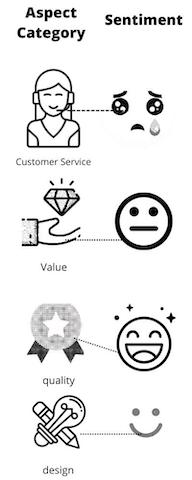
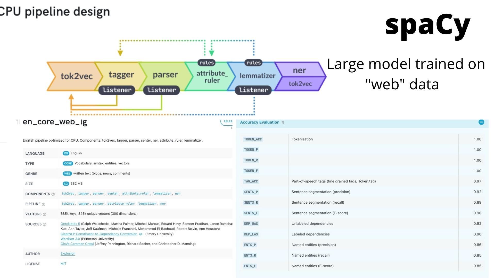

# Aspect/Modifier Classification Analysis

## Project Links

Below is the link for the GitHub project page. 

[Github link](https://github.com/ddey117/ABSA_Project_4)

Import research papers for developement of parser logic.
Includes pdf links for spaCy research paper as well as VADER sentiment intensity analyzer.
Much work has been done on aspect based sentiment analysis. Please feel free to check out some previous work in the link below. 

[Research Papers](https://github.com/ddey117/ABSA_Project_4/tree/main/research_papers)

For another way to navigate of my overall project, please feel free to check out a HTML version of my project overview at the link below. There is also a link in this directory to see an example of what exactly a Turk worker was looking at when they were labeling data for this project. 

[html project directory](https://github.com/ddey117/ABSA_Project_4/tree/main/html)


## Overview 


    The target for this project is an established e-commerce business with a large amount of review data, such as Amazon.com or other online retailers. The goal of this project is to take advantage of technology and models provided by Spacy combined with a pretrained sentiment intensity classifier provided by the NLTK toolkit in order to perform more fine grained sentiment analysis at scale in an efficient manner. This project takes advantange of the parsing and part of speech tagging capabilites of Spacy's pipeline in order to extract aspect/opinion/sentiment triplets. After the aspects are identified, they can be grouped using unsupervised machine learning clustering techniques; in this case k-means clustering for model speed and simplicity. The buisness can use the finished product to quickly transform a large amount of informal review data (text data from reviews that may ramble for pages) and transform it into helpful graphs in order to tune into a small number of categories and help funnel resources into areas where they are most needed.  


Author: Dylan Dey


The Author can reached by email: ddey2985@gmail.com


## Buisness Problem
   
 

           
    Sentiment analysis involves computationally identifying and categorizing the sentiment expressed by an author in a body of text. It has a wide range of applications in industry from stock speculation using sentiment expressed in news and blogs, to identifying customer satisfaction from their reviews and social media posts. 
    Today, most e-commerce website designs include a section where their customers can post reviews for products or services. Customers are free to write how they feel about fine grained aspects of a product at length. From a business perspective, very valuable information can be extracted from this section, such as customers' opinion on a product, understanding of a product, etc..
     On Amazon.com the rating can be between 1 and 5 where 1 is the worst and 5 is the best. A customer can leave as lengthy of a review as they wish about a product to explain why a given rating was posted.  For example, a customer may give a product a low rating because they didn't like someone they spoke to in customer service but liked everything else about the product.  In typical sentiment analysis, these kinds of nuances would be missed since it could only be determined  if the overall body of the review contained positive, neutral, or negative sentiment. Valuable information would be left on the table. 
     There is potentially a disconnect from the amazon review ratings, and the overall sentiment of the body text explaining the review, especially if you begin to break down the text into smaller aspects. Thus, Aspect Based Sentiment Analysis (ABSA) was chosen to see if a deeper understanding of each product can be gained by breaking down each review into aspect categories to be paired with predicted sentiment, which will then be compared with the overall rating (1-5). 
     It is often difficult to efficiently get useful data from a large collection of text data. A lot of e-commerce websites have thousands of reviews and more incoming all of the time. Thousands of reviews with hundreds of words of mostly unhelpful information seems fairly unmanageable to most companies. While the reviews are rather informal, if they are carefully broken down there is information worth saving before generalizing again for efficiency. Aspect Based Sentiment Analysis can transform a messy collection of thousands of informal reviews into a neat and manageable collection of a few aspect categories, in this case 4 different categories using the out of box  Aspect/Opinion/Sentiment Triplet Extractor. Each category will have an associated degree of sentiment related to it, and therefore graphics can easily be prepared and presented to digest more precisely what it is that customers do and do not like about a product in a quickly digestible format in real time. By breaking it down into these categories, say for example Product Design, Value, Quality, and Customer Support, the mass of text data has now been transformed into a numerical representation of sentiment towards broad categories of a product that can be directly improved upon by the company. If a product scores very high sentiment for value and design but lower scores for customer support, then a company knows it doesnt need to invest more money into improving the product and actually needs to focus on improving how its forward facing employees interact with customers. 


## The Data

Helpful links: 

[ReadMe file for Amazon Product Reviews](https://s3.amazonaws.com/amazon-reviews-pds/readme.html)
[MetaData](https://s3.amazonaws.com/amazon-reviews-pds/tsv/index.txt)


The Amazon Customer Reviews (Product Reviews) contains over 130+ million customer reviews available to researchers in TSV files in the amazon-reviews-pds S3 bucket in AWS US East Region, as per the provided readme file. The reviews were collected from 1995 to 2015. See the provided link for associated metadata. This project focuses on the dataset given by pulling “https://s3.amazonaws.com/amazon-reviews-pds/tsv/amazon_reviews_us_Electronics_v1_00.tsv.gz” from the S3 bucket.

Product_id ["B0001FTVEK"](https://www.amazon.com/Sennheiser-RS120-Wireless-Headphones-Charging/dp/B0001FTVEK) was chosen to showcase the triplet extractor as it had a large amount of verified reviews and a pair of headphones seemed like a reasonable choice for aspect based sentiment analysis.

##### Clean Data
Text data trends towards exponential growth with increasing dataset size. Therefore, text cleaning and preprocessing was a major considersation of this project. Please refer to my [Text Preprocessing Toolset](https://github.com/ddey117/preprocess_ddey117) that I created to use for this and other projects that involve text data preprocessing. 


#### Unlabeled Data Created Through Unsupervised Learning

This project showcases an out of box product for extracting opinon/aspect/sentiment triplets from a large amount of messy text data and converting it into a neat set of categories for analysis. To do this, however, it takes advantage of some simple clustering techniques from the sklearn cluster library. For this project, kmeans clustering was chosen for speed and simplicity. Error analysis will be discussed later in more detail in regards to how the model performs with clustering the reviews appropriately into categories and what issues it may run into when parsing internet language. Error analysis for the [SentimentIntensityClassifier](https://www.nltk.org/howto/sentiment.html) offered by the Natural Language ToolKit (NLTK library) will be tested against this 'newly' generated data from my unsupervised learning will be performed by comparing to a seperate set of hand labeled aspect/modifier pairs by humans in an expiremental setting. 

##### experimental setup
 Using the following [Turk_Form_HTML](Turk_Instructions.html) I crowdsourced some labels from humans using Amazon Mechanical Turk to compare to my model using the SentimentIntensityAnalyzer for each aspect/modifier pair extracted from the Amazon reviews. Amazon Mechanical Turk works by quickly dispersing large amounts of data to a large number of people in order to complete simple tasks for a reward. This experiment was set up to reward a penny for each aspect/modifier pair labeled for sentiment from very negative to very positive with an option for NA from a drop down menu (see html above for reference). In total, 410 workers submitted 6107 non-null aspect/opinion pairs for sentiment intensity pertaining to 1438 unique aspects. Duplicate pairs of aspect/opinion pairs were included to inspect variance of submission from human labels and machine labels for each opinion pair. No qualifications or screening was put in place before the workers were chosen, but I did review sections of the data and accept or reject what seemed reasonable. An additional 860 aspect/modifier pairs were hand labeled by a family member who only knew that the labels were extracted from amazon reviews about headphones and followed a similar template as the turk HTML. 


All labels were generated using my triplet extractor on the dataset describing Product_id ["B0001FTVEK"](https://www.amazon.com/Sennheiser-RS120-Wireless-Headphones-Charging/dp/B0001FTVEK) and randomized for different aspect/modifier pairs before sending out to humans for rating for sentiment. 


A large collection of amazon reviews that fall under the "electronics" category. For this project, product_id "B0001FTVEK" was chosen as it had a large amount of verified reviews and a pair of headphones seemed like a reasonable choice for aspect based sentiment analysis.


A simple package I created for preprocessing text data. 
[ddey117 Preprocessing Library](https://github.com/ddey117/preprocess_ddey117)

## Explaining The Parser


<b><span style="color:Green">Clustering and Polarity</span></b>

A large number of amazon reviews produce a large number of aspect-modifier pairs. These pairs ultimately seemed to diverge to common topics, and therefore it would make sense to use machine learning to automatically figure out these categories for us. This leads to a better summation of insight from the total pool of customers who were kind enough to leave a review. Polarity scores are also averaged out of every cluster to give a quantifiable explanation to opinion to distinct categories of a given product. 


<b><span style="color:Blue">Word Vectors and Clustering</span></b>

In order to work with any amazon review data, first the text data must be converted into something that a machine can recognize. The most famous implementation of words vectors is the word2vec project. However, spaCy vectorization was chosen for this projec as it provides fast and easy access to over a million unique word vectors, and its multi-task CNN model is trained on 'web' data and not 'newspaper' data as in other libraries like NLTK.

The word vectors were then grouped using K-Means clustering algorithm in Scikit-Learn. Other clustering algorithms such as DBSCAN  were tested. However, K-Means gave optimal results with four clusters. The clusers were labeled with input from a user after suggesting the top most common word for each cluster. 


Below Is the pipeline design for spaCy and a description for the size and sources for the model loaded to run this project and parse the amazon reviews. 

[en_core_web_large](https://spacy.io/models/en#en_core_web_lg)




<div class="alert alert-block alert-danger">

"spaCy uses the terms **head** and **child** to describe the words connected by a single arc in the dependency tree. The term **dep** is used for the arc label, which describes the type of syntactic relation that connects the child to the head. As with other attributes, the value of .dep is a hash value. You can get the string value with .dep_."   [Navigating The Parse Tree](https://spacy.io/usage/linguistic-features#navigating)

</div>

<div class="alert alert-block alert-info">
    
<span style="color:green"><b>First Rule of Dependency Parser:</b>  The Aspect (A) token is a subject noun with a child modifier (M) that has a relation of amod (adjectival modifier). This just means that the aspect and opinion share a simple adjective/noun relationship that can be extracted. However, there are certain caveats that need to be kept in mind when parsing the tree for this rule. </span> 

  
   - <span style="color:green">First, it is important to check to see if there is an additional adverbial modifier that could adjust the intensity of the sentiment implied by the adjective and adverb combination in regards to the subject/aspect. This is important to keep in mind as we are taking advantage of NLTK vader sentiment intensity analyzer which can make use of additional adverbs to get a better understanding of sentiment.</span>   
   
  
   - <span style="color:green">
    Another important thing to keep in mind when parsing for this rule is to be aware of the possibility of negating the adjective with ‘no’ as a determiner. </span>

                                                                
                                                                
                                                                
                                                                
</div>

<div class="alert alert-block alert-warning">
    
<b>First Rule Examples</b>

<b>Example1:</b> The <span style="color:green">comfortable</span> <span style="color:blue">headphones.</span> 

<b>Example2:</b> The <span style="color:purple">most</span> <span style="color:green">comfortable</span> <span style="color:blue">headphones.</span>

<b>Example3:</b><span style="color:red"> No</span> <span style="color:green">comfortable</span> <span style="color:blue">features.</span>


- <span style="color:red">det = determiner</span>

- <span style="color:blue">A = aspect</span>

- <span style="color:green">M = modifier</span>

- <span style="color:purple">amod = adjectival modifier</span>
</div>

<div class="alert alert-block alert-info">
    
<span style="color:green"><b>Second Rule of Dependency Parser:</b>  The aspect (A) is a child of something with a relation of nominal subject (nsubj.) while the modifier (M) is a child of the same something with a relationship of direct object. In this case, the adjective would be acting as the determiner of the clause. For simplicity's sake, it was determined to assume that each verb will have only one NSUBJ and DOBJ. This is a fair assumption for the application of this project, because even if there are multiple subjects, they will both be reviewing the same thing and will likely share the same opinion as it is written as a single review. For example, if an author were to say “My wife and I bought the awesome headphones”, we still only want to extract the keywords ‘awesome’ and ‘headphones.’ If this sounds confusing, hopefully the example below will help clarify. </span>                                                                 
</div>

<div class="alert alert-block alert-warning">
    
<b>Second Rule Example</b>

<b>Example:</b><span style="color:red"> I </span>bought the <span style="color:green">awesome</span> <span style="color:blue">headphones.</span>


- <span style="color:red">nsubj = nominal subject</span>

- <span style="color:blue">dobj =headphones</span>

- <span style="color:green">det= awesome</span>


</div>

<div class="alert alert-block alert-info">
    
<span style="color:green"><b>Third Rule of Dependency Parser:</b>  The modifier (M) is a child of something with a relation of an adjectival complement (acomp), while the aspect (A) is a child of that same something with a relation of nominal subject (nsubj). </span>    

   - <span style="color:green">This rule needs to handle special cases in which the child is tagged as a modal verb with an auxiliary dependency. This would flag for phrases such as “the sound of the speakers could be better.” For special cases like this, the parser will add a negative prefix before scoring the aspect/modifier pairs for sentiment.</span>   
</div>

<div class="alert alert-block alert-warning">
    
<b>Third Rule Examples</b>

<b>Example1:</b> Barb is <span style="color:green">happy</span> about the <span style="color:blue">sound quality.</span> 

<b>Example2:</b> <span style="color:blue">This</span><span style="color:green"> could be better.</span>

Example2 would be extracted as A= "this" and M= "not better"


- <span style="color:blue">A = aspect</span>

- <span style="color:green">M = modifier</span>


</div>

<div class="alert alert-block alert-info">
    
<span style="color:green"><b>Fourth Rule of Dependency Parser:</b>  The aspect (A) is a child of something with a relationship of passive nominal subject (nsubjpass) while the modifier (M) is a child of that same something with a relationship of adverbial modifier (advmod). In other words, the modifier is an adverbial modifier to a passive verb. </span>    

   - <span style="color:green"> nsubjpass: A passive nominal subject is a noun phrase which is the syntactic subject of a passive clause. </span>  
   
   - <span style="color:green"> This step of the parser will also check to add a negative prefix before extracting and scoring for sentiment if necessary </span>
  
  
</div>

<div class="alert alert-block alert-warning">
    
<b>Fourth Rule Examples</b>

<b>Example1:</b> The <span style="color:blue">headphones</span> died <span style="color:green">quickly.</span> 


- <span style="color:blue">A = aspect</span>

- <span style="color:green">M = modifier</span>

<div class="alert alert-block alert-info">
    
<span style="color:green"><b>Fifth Rule of Dependency Parser:</b>  The aspect (A) is a child of the modifier with a relationship of nominal subject, while the modifier has a child with a relation of copula(cop).
Here the parser is looking for the complement of a copular verb. An often used copula verb is the word “is,” as in the phrase “Bill is big." </span>    

   - <span style="color:green"> Assumption - A verb will have only one NSUBJ and DOBJ </span>  
   
   - <span style="color:green"> cop: copula A copula is the relation between the complement of a copular verb and the copular verb. (We normally take a copula as a dependent of its complement. </span>
  
  
</div>


<div class="alert alert-block alert-warning">
    
<b>Fifth Rule Example</b>

<b>Example1:</b> The <span style="color:blue">sound</span> is <span style="color:green">awesome.</span> 


- <span style="color:blue">A = aspect</span>

- <span style="color:green">M = modifier</span>


<div class="alert alert-block alert-info">
    
<span style="color:green"><b>Sixth Rule of Dependency Parser:</b>  Aspect/modifier are children of an interjection </span>    

   - <span style="color:green"> NTJ (interjections like bravo, great etc)</span>  
   
 
</div>


<div class="alert alert-block alert-warning">
    
<b>Sixth Rule Example</b>

<b>Example1:</b> <span style="color:green">Bravo,</span> <span style="color:blue">headphones.</span> 


- <span style="color:blue">A = aspect</span>

- <span style="color:green">M = modifier</span>

<div class="alert alert-block alert-info">
    
<span style="color:green"><b>Seventh Rule of Dependency Parser:</b>  This rule is similar to rule 5, but makes use of the attr (attribute) tag instead. It seems to function similarly, in which an attribute is considered a noun phrase following a copular verb </span>    

   - <span style="color:green"> ATTR - link between a verb like 'is/seem/appear/became' and its complement</span>  
  
</div>

<div class="alert alert-block alert-warning">
    
<b>Seventh Rule Example</b>

<b>Example1:</b> <span style="color:blue">This</span> is <span style="color:green">garbage.</span> 


- <span style="color:blue">A = aspect</span>

- <span style="color:green">M = modifier</span>

<div class="alert alert-block alert-danger">
<b>For all Parsing:</b> SpaCy has a large library of named entities it can recoginize and tag. This logic is added for each step in the model.
</div>

## For More Information

Please review our full analysis in the [Exploratory Jupyter Notebook](./Apple_Twitter_Sentiment_Exploratory_Notebook.ipynb) and the [Modeling Jupyter Notebook](Apple_Twitter_Sentiment_Modeling.ipynb) or the [presentation](./Project_Presentation.pdf).

For any additional questions, please contact:

Author Name: Dylan Dey

Email: ddey2985@gmail.com

## Repository Structure

Describe the structure of your repository and its contents, for example:

```
├── README.md                     <- The top-level README for reviewers of this project
├── Exploratory_Notebook.ipynb    <- exploratory notebook
├── Exploratory_Notebook.pdf      <- PDF version of exploratory notebook
├── Sentiment_Modeling.ipynb      <- modeling notebook
├── Sentiment_Modeling.pdf        <- modeling notebook pdf
├── Project_Presentation.pdf      <- project presentation pdf
├── data                          <- Both sourced externally and generated from code
└── images                        <- Both sourced externally and generated from code
```
